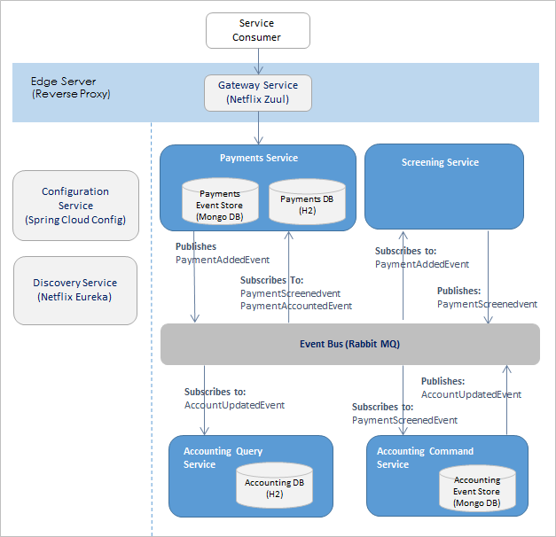

## Reactive Microservices
The high level of autonomy and isolation present in the Microservices Architecture pattern has the biggest impact on the design and the architecture. It also presents us with a challenge of building resilient applications and distributed data management. 

A microservice must react to failure, react to load and react to user. It should also be able to manage data consistency using transactions that are distributed across a network of many different applications and databases.

To achieve the above properties, it is important to have an asynchronous boundary, that can provide decoupling of services. There are tried and tested patterns for successfully building and maintaining complex distributed systems using Event Sourcing and Command Query Responsibility Segregation (CQRS). 

This sample project showcases `event-driven` microservices to build distributed resilient applications using Event Sourcing and Command Query Responsibility Segregation (CQRS) patterns.

## Table of Contents
* [Application Architecture](#application-architecture)
* [Architecture Components](#architecture-components)
* [Reactive Principles] (#reactive-principles) 
* [Event Sourcing] (#event-sourcing) 
* [Command Query Responsibility Segregation] (#cqrs)

##  Application Architecture
This project introduced is about a fictitious `Payment` execution application. Payments can be added for payment execution, stored, retrieved using RESTful API service. As changes happen for example payment screening and accounts updates for the payment amount, notifications are sent to interested services using messaging.

Architecture consists of business services and backing services from Pilot-Microservices such as [Configuration Service] (https://code.cognizant.com/mrudul-palvankar/Pilot-Microservices/blob/master/configuration-service/README.md) and [Discovery Service] (https://code.cognizant.com/mrudul-palvankar/Pilot-Microservices/blob/master/discovery-service/README.md). Each component is built separately using their own build file.  

[Business services] (architecture-components) (Payments Service, Screening Service, Accounting Command Service and Accounting Query Service) communicate with each other through event passing to execute a payment. All communication between the microservices is purely `event-driven`. The events are passed between the microservice components using RabbitMQ messaging. They use EventStore to store the events and maintain a `materialised view` which holds the latest state of an entity.

##  Architecture Components
* [Payments Service] (payments-service/README.md) - Payments Service is responsible for executing a payment and accepts a payment for execution. It publishes PaymentAddedEvent and consumes events generated by other services such as PaymentScreenedEvent and AccountUpdatedEvent. It also maintains a materialized view of Payment and exposes end points to retrieve them.

* [Accounting Command Service] (accounting-command-service/README.md) - Accounting Command Service contains all the domain logic and business rules. It consumes PaymentScreenedEvent and generates AccountUpdatedEvent which are persisted into EventStore (MongoDB) and propagated out to other processes via RabbitMQ messaging.

* [Accounting Query Service] (accounting-query-service/README.md) - Accounting Query Service acts as an event-listener and a view. It listens for the `Events` being emitted by the command-side and processes them. In this example, the query-side simply builds and maintains a ‘materialised view’ or ‘projection’ which holds the latest state of the individual Account. 

* [Screening Service] (screening-service/README.md) - Screening Service responsible for screening a payment, consumes PaymentAddedEvent and generates PaymentScreenedEvent. 

##  Reactive Principles 
* Today’s most popular services—from Twitter to Apple Siri—are distributed by default, and designed for unprecedented numbers of concurrent users, data volumes and speeds. The characteristics of Reactive systems — designed to be [Responsive, Resilient, Elastic and Message Driven] (http://www.reactivemanifesto.org/) to support these new extremes and they are becoming popular for bringing new software to market.

##  Command Query Responsibility Segregation
* CQRS is based in Bertrand Meyer's CQS (Command-Query Separation) concept. CQS states that every method should either be a command that performs an action or a query that retrieves a result. The basic idea is to divide the operations that act on a domain object into two distinct categories:
* Queries—methods that return a result and do not change the system state.
* Commands—methods that change the system state but do not return values.

The events are persisted into the event repository. The business model database can therefore contain the last state of the system, but the event repository keeps the whole history of the data. With this separation of concerns, the developer is free to choose the most appropriate technology for each pattern component, and can (if desired) build a polyglot application. In this example it uses Mongo DB for event repository and H2 database as query database.

##  Event Sourcing 
* Event Sourcing is architecture pattern that represents state as series of events. In event-sourcing, events are the sole record of state for the system. They are used by the system to describe and re-build the current state of any entity on demand (by replaying it’s past events one at a time until all previous events have been re-applied). 

## Using the Application

#### Running on local machine
* You can build the projects by maven. 
    * Maven: Run maven at the parent project "Janus-ReactiveMicroservices", this will build all the individual projects. Run the  individual project jar by running the command: mvn spring-boot:run

* You can run the applications in the order listed below.
    * Configuration Service - This application should be run first as it holds properties for all applications 
    * Discovery Service - This application should be run second as all the services register themselves with discovery server
    * All other services such as Payments Service, Screening Service and Accounting Service

* Please refer to the individual readme files on instructions of how to run the services. 