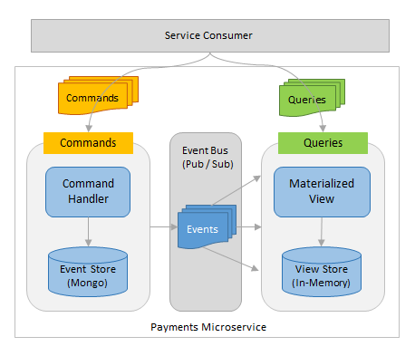

## Overview
Payments Service exposes REST endpoints to execute a payment and to retrieve a list of payments. It uses event sourcing and CQRS patterns. 

* The consumer interacts with the service in two ways: it sends a command to the service to execute a payment and it queries the service for a list of payments.

* Command handler responds to a specific type of command and executes logic based on the contents of the command. The execution of these commands results in `Events` being generated which are persisted into MongoDB and propagated out to other services via RabbitMQ messaging.

* The query-side microservice acts as an event-listener and a view. It listens for the `Events` being emitted by the command-side and processes them. It uses in-memory data store to store and retrieve the payments.

## Pre-requisites
* Install MongoDB

* Create paymentsdb schema
  * Connect mongo db using terminal window command >mongo
  * Use command 'use paymentsdb' to create payments schema
  
## Running the application
* Build the application by running the command: mvn clean install
* Run the application by running the command: java -jar build/libs/payments-service-0.0.1-SNAPSHOT.jar

* Post a payment by invoking the service by using the below urls
  * http://localhost:9090/payments

* Retrieve a list of Payments
  * http://localhost:9090/payments

## External Configuration
The project derives it's configuration from the configuration-service. We have defined the spring.cloud.config.uri in the bootstrap.yml file and that tells the application where to pick up the external configurations. In our case, the URL points to the running configuration-service (http://localhost:8888). 

Important dependencies in classpath
* spring-cloud-config-client dependency so that the application can consume the config server
* spring-cloud-starter-eureka dependecy to register the service in discovery server 

